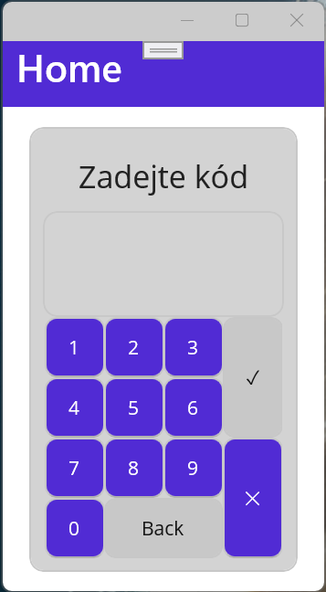
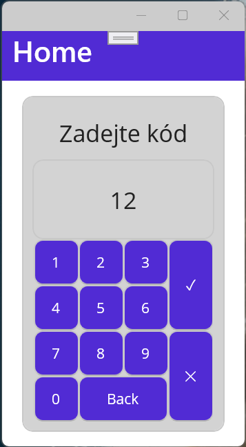
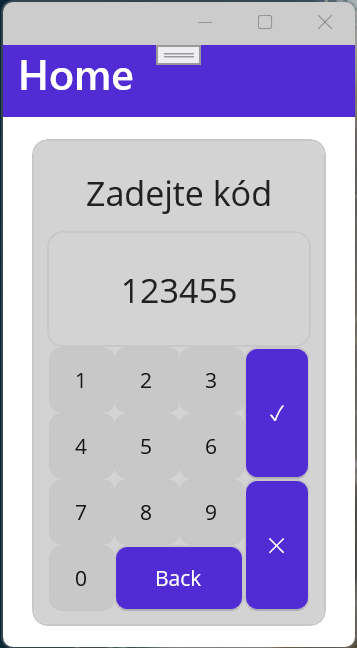
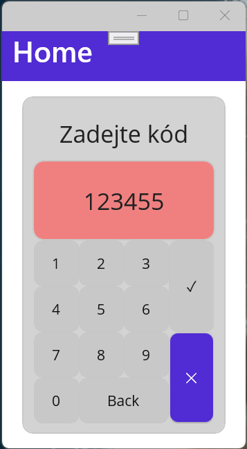
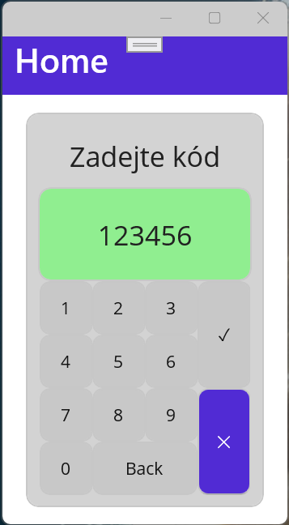

# Test na MVVM v prostøedí MAUI

Vytvoøte fiktivní aplikaci pro zadávání èíselného kódu. Pøedmìtem testu je pøipojení ViewModelu ke stránce, bindování komponent, použití commandù s parametrem a podmínkou.

## Screenshoty

## Chování aplikace

* Èíslice 
	* Jsou aktivní pokud nemá kód délku 6 znakù a stav aplikace je InProgress
	* Pøidávají nový znak na konec kódu
* Back 
	* Odmazává poslední znak 
	* Je aktivní, pokud je v kódu alespoò jeden znak a stav aplikace je InProgress
* OK 
	* Vyhodnocuje zadaný kód a podle toho nastavuje vlastnost State
	* Je aktivní pro více než dva znaky a stav aplikace je InProgress
* Storno 
	* Resetuje stav aplikace - tedy kód i stav
	* Je aktivní vždy
* Bindovatelné vlastnosti
	* Aplikace má dvì: Code a State

## Zadání

* ViewModel
	* 2 Bindovatelné vlastnosti
	* 4 Commandy
* Provázat vlastnosti a Commandy tak, aby se vše zobrazovalo správnì
* Pøipojit ViewModel do stránky
* Converter pro pøevod mezi stavem aplikace a barvou Frame pod kódem

## Fragmenty kódu

	Code = Code.Remove(Code.Length - 1, 1);

